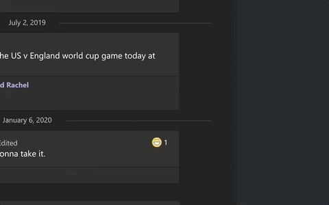

#ka

`git@github.com:TheDread-Pirate-Roberts/apps.git`

```
* unzip ka
* give ka accessibility permissions
```
```
Have app you want to keep alive open but not taking up the center of the screen
```


