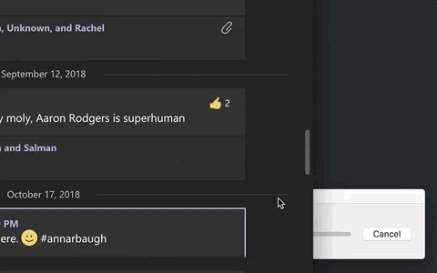

### ka

```
* unzip ka
* move unzipped app to Applications
* give ka accessibility permissions
```
```
Open ka, and click in your app.
```

```
It will do it's thing until you click cancel then quit.
```

